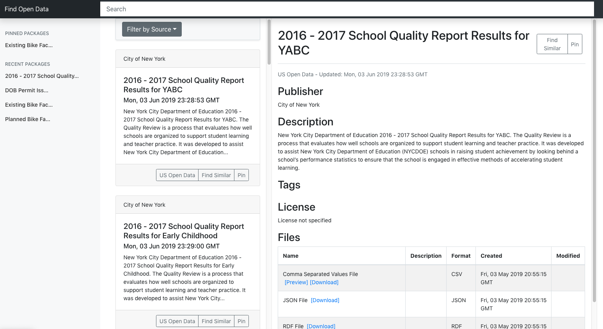

# Find Open Data

[](https://travis-ci.org/findopendata/findopendata)

This is the source code repository for [findopendata.com](https://findopendata.com).



## Development Guide

To develop locally, you need the following:

* PostgreSQL 9.6 or above (or Cloud SQL Proxy)
* RabbitMQ
* A Google Cloud project with Cloud Storage enabled.
* Google Cloud service account key file (JSON formatted) with access to
Cloud Storage bucket

**TODO**: get rid of Google Cloud requirement for local development.

### System Overview


### Set up local develop environment

#### 1. Install PostgreSQL

[PostgreSQL](https://www.postgresql.org/download/) 
(version 9.6 or above) is used by the crawler to register and save the
summaries of crawled datasets. It is also used by the API Server as the 
database backend.
If you are using Cloud SQL Postgres, you need to download 
[Cloud SQL Proxy](https://cloud.google.com/sql/docs/postgres/connect-admin-proxy#install)
and make it executable.

Once the PostgreSQL database is running, create a database, and
use the SQL scripts in `sql` to create tables:
```
psql -f sql/create_crawler_tables.sql
psql -f sql/create_metadata_tables.sql
psql -f sql/create_sketch_tables.sql
```

#### 2. Install RabbitMQ

[RabbitMQ](https://www.rabbitmq.com/download.html) 
is required to manage and queue crawl tasks.
On Mac OS X you can [install it using Homebrew](https://www.rabbitmq.com/install-homebrew.html).

Run the RabbitMQ server after finishing install.

#### 3. Python Setups

We use virtualenv for Python development and dependencies:
```
virtualenv -p python3 pyenv
pip install -r requirements.txt
```

#### 4. Configuration File

Create a `configs.yaml` by copying `configs-example.yaml`, complete all fields.


## Crawler Guide

The crawler has a set of [Celery](http://www.celeryproject.org/) tasks that 
runs in parallel.
It uses the RabbitMQ server to manage and queue the tasks.

### Data sources

The crawler uses PostgreSQL to maintain all data sources.
CKAN sources are maintained in the table `findopendata.ckan_apis`.
Socrata Discovery APIs are maintained in the table 
`findopendata.socrata_discovery_apis`.
The SQL script `sql/create_crawler_tables.sql` has already created some 
initial sources for you.

### Socrata App Tokens

Add your [Socrata app tokens](https://dev.socrata.com/docs/app-tokens.html) 
to the table `findopendata.socrata_app_tokens`.
The app tokens are required for downloading datasets from Socrata APIs.

For example:
```sql
INSERT INTO findopendata.socrata_app_tokens (token) VALUES ('<your app token>');
```

### Run Crawler

Celery workers must be started first.

For example:
```
celery -A crawler worker -l info -Ofair
```

The following scripts are used to kick-start different stages of crawler tasks:

1. `crawl.py` is used for starting data harvesting tasks that download 
datasets from various data sources. Downloaded datasets will be stored on
a Google Cloud Storage bucket (set in `configs.yaml`), and registed in 
Postgres tables `findopendata.ckan_packages` and `findopendata.socrata_resources`.
2. `index_packages.py` is used for generating metadata for downloaded
datasets. It generate metadata by extracting titles, description etc. and 
annotates them with entities for enrichment.
The generated metadata is stored in table `findopendata.packages`, which is 
also used by the API server to serve the frontend.