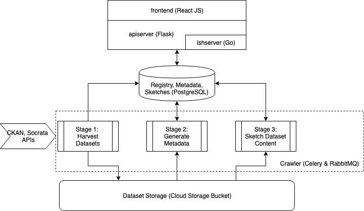

# Find Open Data

[](https://travis-ci.org/findopendata/findopendata)

This is the source code repository for [findopendata.com](https://findopendata.com).
The project goal is to make a search engine for Open Data with rich 
features beyond simple keyword search. The current search methods are:

* Keyword search based on metadata
* Similar dataset search based on metadata similarity
* Joinable table search based on content (i.e., data values) similarity using LSH index

Next steps:

 * Unionable/similar table search based on content similarity
 * Time and location-based serach based on extracted timestamps and Geo tags
 * Dataset versioning
 * API for external data science tools (e.g., Jupyter Notebook, Plot.ly)

**This is a work in progress.**


## System Overview

The Find Open Data system has the following components:

1. **Frontend**: a React app, located in `frontend`.
2. **API Server**: a Flask web server, located in `apiserver`.
3. **LSH Server**: a Go web server, located in `lshserver`.
4. **Crawler**: a set of [Celery](https://docs.celeryproject.org/en/latest/userguide/tasks.html) tasks, located in `crawler`. 

The Frontend, the API Server, and the LSH Server can be 
deployed to 
[Google App Engine](https://cloud.google.com/appengine/docs/).

We also use two external storage systems for persistence:

1. A PostgreSQL database for storing dataset registry, metadata,
and sketches for content-based search.
2. A Google Cloud Storage Bucket for storing dataset files.



## Development Guide

To develop locally, you need the following:

* PostgreSQL 9.6 or above
* RabbitMQ
* A Google Cloud project with Cloud Storage enabled.
* Google Cloud service account key file (JSON formatted) with read and write access to Cloud Storage bucket

**TODO**: get rid of Google Cloud requirement for local development.

### Set up local development environment

#### 1. Install PostgreSQL

[PostgreSQL](https://www.postgresql.org/download/) 
(version 9.6 or above) is used by the crawler to register and save the
summaries of crawled datasets. It is also used by the API Server as the 
database backend.
If you are using Cloud SQL Postgres, you need to download 
[Cloud SQL Proxy](https://cloud.google.com/sql/docs/postgres/connect-admin-proxy#install)
and make it executable.

Once the PostgreSQL database is running, create a database, and
use the SQL scripts in `sql` to create tables:
```
psql -f sql/create_crawler_tables.sql
psql -f sql/create_metadata_tables.sql
psql -f sql/create_sketch_tables.sql
```

#### 2. Install RabbitMQ

[RabbitMQ](https://www.rabbitmq.com/download.html) 
is required to manage and queue crawl tasks.
On Mac OS X you can [install it using Homebrew](https://www.rabbitmq.com/install-homebrew.html).

Run the RabbitMQ server after finishing install.

#### 3. Python Environment

We use virtualenv for Python development and dependencies:
```
virtualenv -p python3 pyenv
pip install -r requirements.txt
```

`python-snappy` requires `libsnappy`. On Ubuntu you can 
simply install it by `sudo apt-get install libsnappy-dev`.
On Mac OS X use `brew install snappy`.
On Windows, instead of the `python-snappy` binary on Pypi, use the 
unofficial binary maintained by UC Irvine 
([download here](https://www.lfd.uci.edu/~gohlke/pythonlibs/)),
and install directly, for example (Python 3.7, amd64):
```
pip install python_snappy‑0.5.4‑cp37‑cp37m‑win_amd64.whl
```

#### 4. Configuration File

Create a `configs.yaml` by copying `configs-example.yaml`, complete all fields.


## Crawler Guide

The crawler has a set of [Celery](http://www.celeryproject.org/) tasks that 
runs in parallel.
It uses the RabbitMQ server to manage and queue the tasks.

### Setup Crawler

#### Data Sources (CKAN and Socrata APIs)

The crawler uses PostgreSQL to maintain all data sources.
CKAN sources are maintained in the table `findopendata.ckan_apis`.
Socrata Discovery APIs are maintained in the table 
`findopendata.socrata_discovery_apis`.
The SQL script `sql/create_crawler_tables.sql` has already created some 
initial sources for you.

To show the CKAN APIs currently available to the crawler and whether they
are enabled:
```sql
SELECT * FROM findopendata.ckan_apis;
```

To add a new CKAN API and enable it:
```sql
INSERT INTO findopendata.ckan_apis (endpoint, name, region, enabled) VALUES
('catalog.data.gov', 'US Open Data', 'United States', true);
```

#### Socrata App Tokens

Add your [Socrata app tokens](https://dev.socrata.com/docs/app-tokens.html) 
to the table `findopendata.socrata_app_tokens`.
The app tokens are required for harvesting datasets from Socrata APIs.

For example:
```sql
INSERT INTO findopendata.socrata_app_tokens (token) VALUES ('<your app token>');
```

### Run Crawler

[Celery workers](https://docs.celeryproject.org/en/latest/userguide/workers.html) 
are processes that fetch crawler tasks from RabbitMQ and execute them.
The worker processes must be started before starting any tasks.

For example:
```
celery -A crawler worker -l info -Ofair
```

#### Harvest Datasets

Run `harvest_datasets.py` to start data harvesting tasks that download 
datasets from various data sources. Downloaded datasets will be stored on
a Google Cloud Storage bucket (set in `configs.yaml`), and registed in 
Postgres tables 
`findopendata.ckan_packages` and `findopendata.socrata_resources`.

#### Generate Metadata

Run `generate_metadata.py` to start metadata generation tasks for 
downloaded and registed datasets in 
`findopendata.ckan_packages` and `findopendata.socrata_resources`
tables.

It generates metadata by extracting titles, description etc. and 
annotates them with entities for enrichment.
The metadata is stored in table `findopendata.packages`, which is 
also used by the API server to serve the frontend.

#### Sketch Dataset Content

Run `sketch_dataset_content.py` to start tasks for creating 
sketches (e.g., 
[MinHash](https://github.com/ekzhu/datasketch),
samples, data types, etc.) of dataset
content (i.e., data values, columns, and records).
The sketches will be used for content-based search such as
finding joinable tables.

## Windows-Specific Issues

### Python Dependencies
